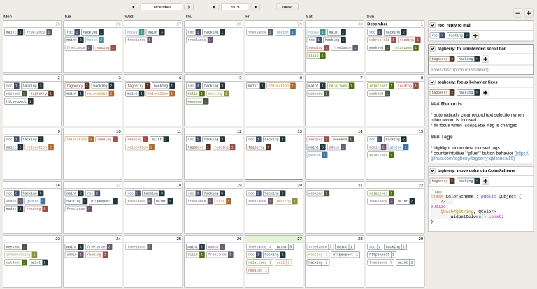

# Tagberry Qt5 desktop app

[](https://travis-ci.org/tagberry/tagberry-qt)

## Features

*Work in progress!*

Tagberry is a tag-oriented Qt5 desktop calendar, task manager, and todo list.

Available features:

* create and edit tasks with tags on the calendar
* markdown highlighting
* SQLite3 database

Planned features:

* create and edit subtasks
* organize tasks in lists
* manage tag properties
* various UI improvements

## Screenshot

[](https://raw.githubusercontent.com/tagberry/tagberry-qt/master/images/screenshot.png)

## Supported platforms

The code is written in a cross-platform manner, but only Linux was tested so far.

## Dependencies

* C++17 compiler
* CMake >= 3.0
* qmake from Qt5 (for dependencies)
* Qt5 >= 5.9
* SQLite3
* [QMarkdownTextEdit](https://github.com/pbek/qmarkdowntextedit) (shipped as a submodule)
* [QSqlMigrator](https://github.com/hicknhack-software/QSqlMigrator) (shipped as a submodule)

## Instructions

### Install dependencies

```
sudo apt install qt5-default cmake
```

### Clone repo

```
git clone --recurse-submodules https://github.com/tagberry/tagberry-qt.git
cd tagberry-qt
```

### Build

```
mkdir build
cd build
cmake ..
make -j4
cd ..
```

### Run locally

```
./bin/tagberry-qt
```

### Install system-wide

```
cd build
sudo make install
cd ..
```

### Format code

```
./scripts/format.sh
```

## Code structure

The codebase is divided into four parts:

* **widgets** - A collection of application-specific widgets, supplementing standard Qt widgets. Widgets don't know anything about models and business-logic.

* **models** - A collection of data objects to be displayed and manipulated by user. Models don't know anything about widgets and UI.

* **storage** - Classes to read and write models from a persistent storage.

* **presenters** - Classes that put all these things together. Presenters create the UI using widgets and interconnect models with widgets and storage.


## Authors

See [here](https://github.com/tagberry/tagberry-qt/graphs/contributors).

## License

[GPLv2+](LICENSE)
